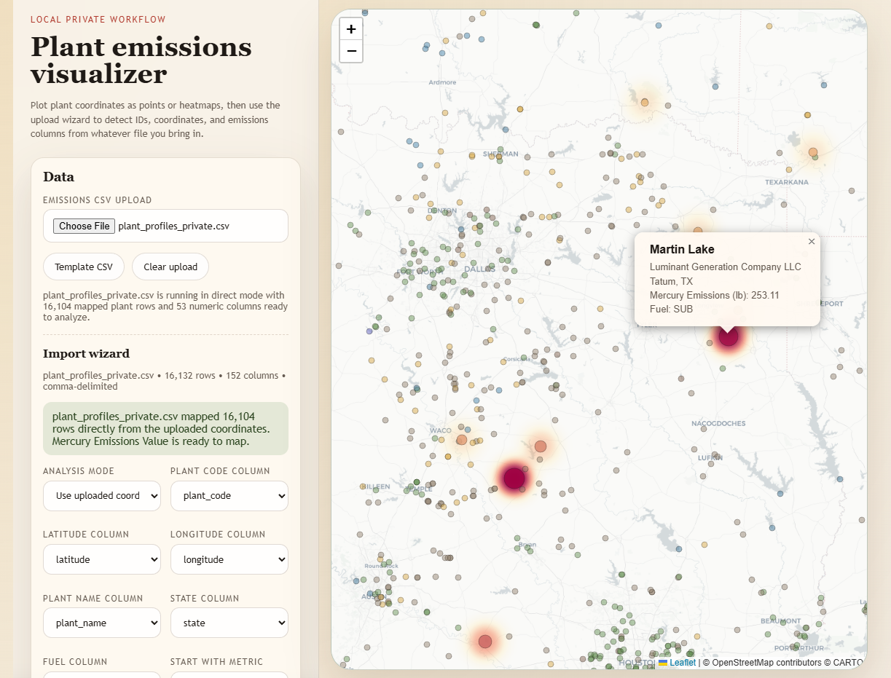

# National Infrastructure Research

This repository is for high-level research on national infrastructure, systemic dependencies, resilience, and public-impact risk.

We will be analyzing and visualizing CO2 and mercury outputs, as well as ambient environmental radio-isotopic emissions on a per plant basis.

## Research Boundaries

- Focus on sector-level analysis, policy, resilience, redundancy, supply chains, and public consequence modeling.
- Do not give exact coordinates, route-by-route mapping, access details, security weaknesses, and operating procedures for sensitive sites.
- As geographic context is needed, prefer broad regional or state-level summaries; use precise point data only when clearly benign, public, and not sensitive.
- Cybersecurity work is defensive, aggregate, and source-led. Do not compile exploit steps, credentials, exposed-system lists, facility cyber architecture, or targeting instructions.

## Core Subject Areas

### 1. Electric Grid

- Transmission network structure
- Bulk power corridors
- Interconnections and balancing authorities
- Major substations by region and function
- Grid redundancy and chokepoints
- Transformer supply chain dependence
- Grid-hardening and restoration constraints
- Publicly documented outage interdependencies

### 2. Power Generation

- Generation mix by region
- Natural gas plants
- Coal plants
- Nuclear plants
- Hydroelectric facilities
- Wind generation clusters
- Solar generation clusters
- Fuel supply dependencies
- Water dependencies for cooling
- Black-start capability at a high level

### 3. Energy Supply Chains

- Natural gas pipelines by corridor
- LNG terminals at a high level
- Fuel storage concentration
- Refinery regions
- Rail dependence for fuel movement
- Ports supporting energy imports and exports

### 4. Communications

- Internet backbone concentration
- Major carrier interconnection regions
- Cellular dependency patterns
- Satellite service dependencies
- Data center concentration
- Cloud provider regional dependence
- Undersea cable landing areas at a high level

### 5. Water and Wastewater

- Regional water treatment capacity
- Wastewater treatment dependencies
- Pumping and power interdependence
- Drought exposure
- Reservoir dependence
- Cross-jurisdiction water sharing

### 6. Transportation

- Rail freight corridors
- Key highway freight corridors
- Port concentration
- Inland logistics hubs
- Major airport cargo regions
- Bridge and tunnel dependency patterns
- Pipeline and rail interface points

### 7. Healthcare

- Hospital concentration by metro area
- Trauma center distribution
- Regional bed capacity
- Pediatric and specialty care distribution
- Pharmacy supply dependencies
- Medical oxygen and cold-chain reliance
- Backup power dependence

### 8. Finance and Economic Continuity

- Banking concentration by region
- Payment network dependencies
- Cash logistics and armored transport
- Financial data center concentration
- Clearing and settlement dependencies
- Market continuity infrastructure

### 9. Government and Defense

- Major federal facilities by region
- State emergency operations structure
- National Guard presence by state
- Military base regions
- Defense industrial base concentration
- Strategic mobility dependencies

### 10. Food and Agriculture

- Food processing concentration
- Cold-chain logistics
- Fertilizer and chemical inputs
- Irrigation dependence
- Livestock transport corridors
- Grain storage concentration

### 11. Cybersecurity And Cyber-Physical Resilience

- Critical infrastructure cyber governance
- IT and OT dependency patterns
- Identity, cloud, telecom, and vendor concentration
- Ransomware and recovery constraints at a sector level
- Cyber-physical interdependence
- Incident reporting and information-sharing pathways
- Secure-by-design and software supply-chain resilience
- Defensive maturity indicators by sector
- Coarse cyber risk summaries without exploit detail

## Critical Considerations

- Interdependence between electric power, telecom, water, fuel, and transportation
- Regional single points of failure
- Restoration order and recovery timelines
- Mutual-aid capacity
- Backup generation limits
- Supply chain fragility for replacement equipment
- Weather and wildfire exposure
- Floodplain and seismic exposure
- Cyber-physical interdependence
- Workforce concentration and specialized labor shortages
- Cross-border and interstate dependencies
- Public health consequences of prolonged disruption
- Economic knock-on effects
- Cascading impacts across adjacent sectors
- Population density near critical service areas
- Seasonal demand stress
- Regulatory fragmentation
- Insurance and financial resilience

## Priority Civilian Assets To Track At A High Level

- Hospitals and trauma centers
- Water treatment and wastewater systems
- Major banking and payments hubs
- Emergency services concentration
- Fuel terminals and refinery regions
- Ports and freight hubs
- Data centers and telecom concentration
- Airports with major cargo roles
- Food distribution centers
- Universities with major research or medical roles

## Priority Government And Strategic Assets To Track At A High Level

- Military base regions
- Defense manufacturing clusters
- Federal administrative centers
- State capitals and emergency management hubs
- National Guard logistics regions
- Strategic port and airlift regions

## Safe Research Structure

Suggested folders:

- `docs/sectors/`
- `docs/regions/`
- `docs/dependencies/`
- `docs/sources/`
- `data/public/`

Suggested files:

- `docs/sectors/electric-grid.md`
- `docs/sectors/power-generation.md`
- `docs/sectors/healthcare.md`
- `docs/sectors/finance.md`
- `docs/sectors/defense.md`
- `docs/sectors/cybersecurity.md`
- `docs/dependencies/cross-sector-risk.md`

## Suggested Method

1. Start with sector summaries and major public dependencies.
2. Break findings down by region or state.
3. Record public consequences, redundancy, and restoration constraints.
4. Tag each finding by sector, geography, and dependency type.
5. Keep location detail coarse unless there is a clearly benign public-interest reason.

## Strategic Resource Visualizer

A local browser visualizer now lives in `docs/plant-emissions-visualizer/`.

Use it to:

- switch between private electrical plants, municipality population points, county agriculture, raw-material sites, and ambient radiation monitors
- render both point and heatmap views from the same interface
- pivot each category across its available numeric metrics
- inspect the full source row for any mapped record

Example views:





Build the private browser asset with:

```powershell
C:\Windows\py.exe scripts\build_private_plant_profiles.py
C:\Users\Danie\AppData\Local\Python\bin\python.exe scripts\download_radnet_background_data.py
C:\Users\Danie\AppData\Local\Python\bin\python.exe scripts\build_radiation_reference.py
C:\Users\Danie\AppData\Local\Python\bin\python.exe scripts\build_people_municipal_reference.py
C:\Users\Danie\AppData\Local\Python\bin\python.exe scripts\build_agriculture_county_reference.py
C:\Users\Danie\AppData\Local\Python\bin\python.exe scripts\build_raws_reference.py
C:\Users\Danie\AppData\Local\Python\bin\python.exe scripts\build_bulk_exports.py
C:\Users\Danie\AppData\Local\Python\bin\python.exe scripts\build_plant_visualizer_assets.py
```

The electrical data pipeline now writes category-scoped outputs under:

- `data/raw/electrical/`
- `data/processed/electrical/`
- `data/public/electrical/`
- `data/private/electrical/`

Additional category outputs now live under:

- `data/public/people/`
- `data/private/people/`
- `data/public/agriculture/`
- `data/private/agriculture/`
- `data/public/raws/`
- `data/private/raws/`
- `data/public/radiation/`
- `data/private/radiation/`
- `data/public-bulk/`
- `data/private-bulk/`

Serve the repo root locally with:

```powershell
C:\Windows\py.exe scripts\serve_repo_root.py
```

Then open:

- `http://localhost:8000/docs/plant-emissions-visualizer/`

See `docs/plant-emissions-visualizer/README.md` for the local workflow and CSV format.

## Next Build-Out

- Add one markdown file per sector
- Add a source log for public datasets and official reports
- Add a schema for non-sensitive regional summaries
- Add a map workflow that uses broad service regions instead of exact sensitive coordinates
- Build the cybersecurity track from `docs/sectors/cybersecurity.md`, `docs/sources/cybersecurity-sources.md`, and `schemas/cyber-risk-summary.schema.json`
